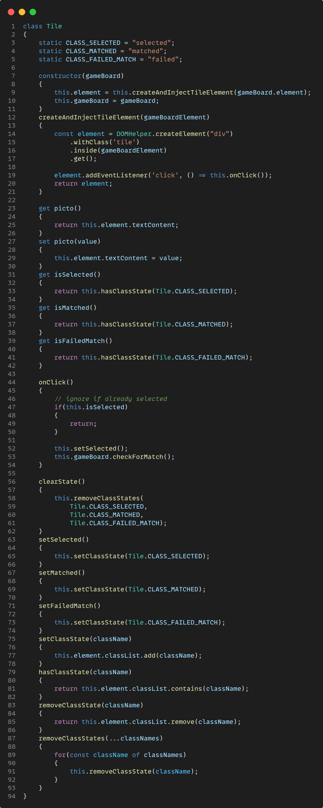

# Short Intro to OOP Modelling and Development Using Vanilla JS

Following up on my last [tweet on OOP design and development](https://twitter.com/LifeLongThinker/status/1538193675099979786), we are going to build a very tiny example web app using only vanilla JS.

We are going to build a "Matching Pairs" game. You can see the game in action here:

Obviously, to keep this example simple, we will make compromises and not follow all SOLID and general best practices. The goal here is to give you a rough idea of what modelling solutions through OOP looks like.

## Step 1: Analyzing the Problem Domain: Components

First, we will analyze the problem domain.

Remember that OOP is all about "building larger parts from smaller parts and their communication among each other". To design the game, we go backwards: How is the overall problem composed of smaller problems?

What smaller parts are involved here? Let's drill the game design down into its (visible) components:

## Step 2: Analyzing the Problem Domain II: Responsibilities

Now that we have figured out the components involved, lets see what kind of responsibilities they have:

These are, of course, only the most visible responsibilities. We will see shortly that other, hidden duties are involved and model them accordingly.

## Step 3: Modelling Classes

Now let's extract classes from our components. We can start by mapping one component to one class. We need to figure out their two key parts: state and behavior, i.e. we have to model their properties and methods (functions).

## Step 3.1: Modelling the 'Tile' Class

The Tile class is one of the most complex classes. Its constructor injects its DOM element into the gameboard element (line 7 ff.). Then it manages its assigned pictogram and state inside the dom. Finally, it listens for click interaction (lines ).

## Step 3.2: Modelling the 'GameBoard' Class

The GameBoard class manages tiles. These are created and injected dynamically inside its constructor (lines 3 ff.). The PictoDictionary (line 12) is a separate class that handles pictogram logic.

 The GameBoard's main responsibility is checking for matches when the user selects tiles (lines 21 ff.).

## Step 3.3: Modelling the 'PictoDictionary' class

The P. is a component that exists only in our Solution Domain. It is a helper function handling pictogram logic, such as selecting a random subset of all available pictograms for display.

## Step 3.4: Modelling the 'AlertBox' class

The A. handles alert messages. Its structure is pretty simple: New messages are added as child elements appended to the root component element (lines 14 ff.). They are then queued for removal after a certain timeout (lines 22 ff.).

## Step 3.5: Modelling the 'DOMHelper' class

The D. is another component that only exists in our solution domain (not in our problem domain). It handles all DOM manipulation and has a 'fluent' interface, so we can chain its methods easily and conveniently.

## Step 3.6: Modelling the 'Game' class

The G. class is simple: It serves as an entry point to start new games and hook up the components involved. When a new game is started (lines 9 ff.), pictos are randomly assigned to tiles.

## Step 4: Hooking Everything Up

Finally, we can hook up the entire components. Our markup is simple: We just have two div elements identified as 'board' and 'alert', which will host our game board and alert box, respectively.

The game logic is then started through the Game class.

